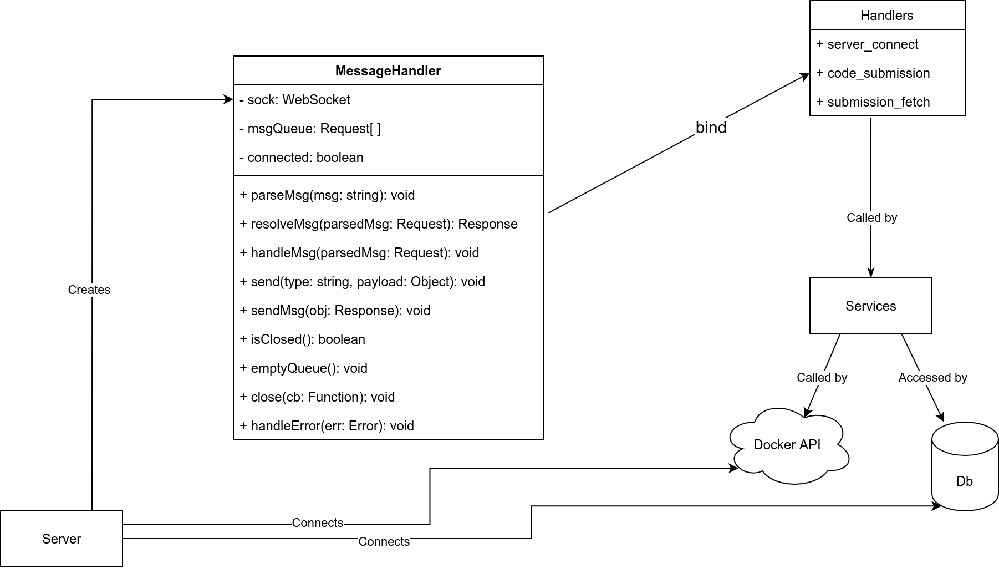
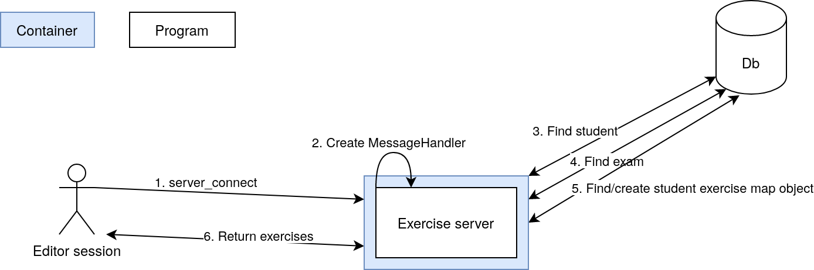
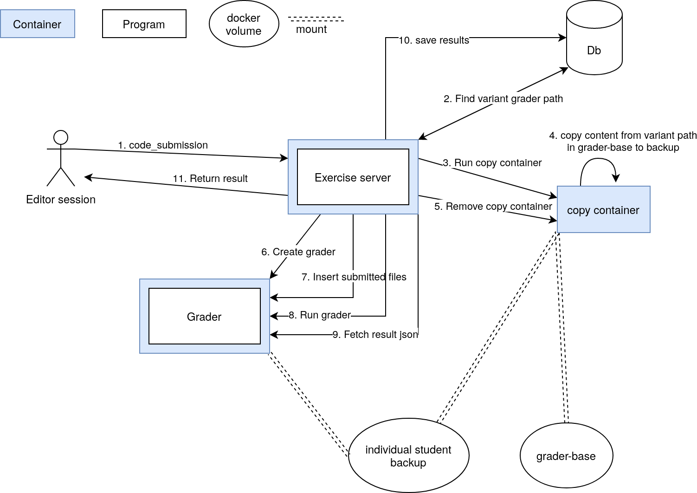

# Konekoe exercise server

This server was developed for conducting online exams with [konekoe-editor](https://version.aalto.fi/gitlab/konekoe/konekoe-editor) frontend. It is used for fetching exam information from the database, saving exercise submissions and running graders with submitted files.

1. [Installation](#1-installation)
2. [Notes about CI runner](#2-notes-about-ci-runner)
3. [Architecture](#3-architecture)
4. [Configuration](#4-configuration)
    1. [Possible values](#41-possible-values)
    2. [Configuring integration tests](#42-configuring-integartion-tests)
5. [Message interface](#5-message-interface)
    1. [server_connect](#51-server_connect)
    2. [submission_fetch](#52-submission_fetch)
    3. [code_submission](#53-code_submission)

## 1. Installation

For local development, running  ```npm install``` and configuring an .env file suffice. However, running the provided tests additionally requires running ```npm install --only=dev``` and ```npm install konekoe-database```. The later install is required due to a bug in npm. See [here](https://github.com/npm/npm/issues/1341) for details. 

Docker images can be built with the commands ```npm run docker:build``` and ```npm run docker:build:dev``` which build images with the latest and dev tags repectively.

## 2. Notes about CI runner

The project utilizes a local Gitlab runner for CI (Continous Integration) and CD (Continous Deployment). The runner is hosted on the examos-dev.comnet.aalto.fi server and [installed inside of docker](https://docs.gitlab.com/runner/install/docker.html). Notably, the runner is passed environment parameters and authentication tokens [via volume mounts](https://docs.gitlab.com/runner/configuration/advanced-configuration.html#example-2-mount-a-host-directory-as-a-data-volume). The authentication tokens are gitlab deploy tokens generated for each private dependency and are mounted inside the container with a local system volume mount. A local system volume mount allows easy access to the token file for updates and additions. These tokens are inserted into the *package.json* file with the *.runner-preinstall.js* script.

The runner has two stages: test and deployment. The test stage runs tests defined in the test/ directory. Notably, these test don't require a database connection as the database interface module [konekoe-database](https://version.aalto.fi/gitlab/konekoe/konekoe-database) supports utilization of inmemory mock databases. Additionally, the test job runs an explicit installation of *konekoe-database* to install all of its dependencies needed for testing. See [here](https://github.com/npm/npm/issues/1341) for why and explicit *npm install* call is needed.

The deployment stage builds a docker image based on the branch on which the runner is executed on. Execution on the main branch builds a latest image and execution on the dev branch a dev image. The dev image is utilized for system wide integration tests and the latest image for production. The deployment stage utilizes a shell runner which inserts values into *package.json* with the *.runner-preinstall.py* script.

## 3. Architecture


The above diagram illustrates the application architecture of the project. The main of the project is *server.js* represented in the diagram as Server. Server connects to the database and Docker API and makes these interfaces available across the application by adding them to the *process* object. Server also creates instances of the MessageHandler class whenever a new client connects and a WebSocket is created.

Essentially, a MessageHandler is a wrapper around a WebSocket that adds parsing and handling for data received from the socket. Message parsing and interfacing with the client are handled with the methods inside of MessageHandler. Received data is parsed with *parseMsg* which passes the results to *handleMsg*. This method calls *resolveMsg* and awaits for the result which is then sent to the client.

Notice that MessageHandler binds external handlers to itself. The handlers are utlized by *resolveMsg* which chooses a handler based on the *type* field of the received message. In the diagram, received messages are referred to as Requests and sent messages as Responses. Section 5 covers the different message types. 

## 4. Configuration

The application requires some configuration before execution. You can find the different configuration fields in *src/utils/Config.js*. The config script attempts to find and parse a JSON file containing configuration values. The default path for the JSON file is *project_root/.env.json* but a custom path can be passed with the *ENV_FILE_PATH* environment variable.

The table below displays the different configuration options. Some fields are mandatory. The values that are not required have either a static default value set in *src/utils/Config.js* or are determined dynamically; dynamically. Setting a configuration value that would otherwise be determined dynamically essentially overrides those fields. This is useful for testing. Lastly, *PORT* is can be set either via a JSON file or an environment variable and is *4000* by default.

### 4.1. Possible values

<table>
  <tr>
    <th>Field name</th>
    <th>Requirement</th>
    <th>Description</th>
    <th>Example value</th>
  </tr>
  <tr>
    <td>PORT</td>
    <td>STATIC DEFAULT</td>
    <td>Port that the web socket server attempts to start listening.</td>
    <td>4000</td>
  </tr>
  <tr style="background-color: #551111">
    <td>
    EXERCISE_DATABASE_URI
    </td>
    <td>REQUIRED</td>
    <td>Location of the database storing exercise and submission information.</td>
    <td>mongodb://example.com/exercises</td>
  </tr>
  <tr style="background-color: #551111">
    <td>DATABASE_AUTH</td>
    <td>REQUIRED</td>
    <td>Name of database used for database authentication</td>
    <td>AdminDb</td>
  </tr>
  <tr style="background-color: #551111">
    <td>DATABASE_USER</td>
    <td>REQUIRED</td>
    <td>Username for database authentication</td>
    <td>Test User</td>
  </tr>
  <tr style="background-color: #551111">
    <td>DATABASE_PASS</td>
    <td>REQUIRED</td>
    <td>Password for database authentication</td>
    <td>Password</td>
  </tr>
  <tr style="background-color: #551111">
    <td>JWT_PUBLIC</td>
    <td>REQUIRED</td>
    <td>Path to public key used for JWT authentication</td>
    <td>/project/root/data/public.key</td>
  </tr>
  <tr>
    <td>JWT_PUBLIC</td>
    <td>STATIC DEFAULT</td>
    <td>Path to private key used for creating JWTs during testing. Not required by application but required by tests.</td>
    <td>/project/root/data/pricate.key</td>
  </tr>
  <tr style="background-color: #551111">
    <td>JWT_ISSUER</td>
    <td>REQUIRED</td>
    <td>String indetifier of the principal that issued the JWT</td>
    <td>Test Issuer</td>
  </tr>
  <tr style="background-color: #551111">
    <td>JWT_SUBJECT</td>
    <td>REQUIRED</td>
    <td>String indetifier of the subject of the JWT</td>
    <td>Exam</td>
  </tr>
  <tr style="background-color: #551111">
    <td>JWT_AUDIENCE</td>
    <td>REQUIRED</td>
    <td>String indetifier of the indended audience of the JWT</td>
    <td>My project</td>
  </tr>
  <tr style="background-color: #551111">
    <td>JWT_EXPIRESIN</td>
    <td>REQUIRED</td>
    <td>Lifetime of the JWT</td>
    <td>60 for 60 seconds or 12h for 12 hours.</td>
  </tr>
  <tr style="background-color: #551111">
    <td>JWT_ALGORITHM</td>
    <td>REQUIRED</td>
    <td>Algorithm used for encryption ([supported options](https://www.npmjs.com/package/jsonwebtoken#algorithms-supported)</td>
    <td>RS256</td>
  </tr>
  <tr>
    <td>DOCKER_HOST</td>
    <td>STATIC DEFAULT</td>
    <td>The application utilizes the Docker API for running grader containers. This field should be the host name of the targeted Docker daemon.</td>
    <td>localhost</td>
  </tr>
  <tr style="background-color: #551111">
    <td>DOCKER_CA_CERT</td>
    <td>REQUIRED</td>
    <td>Path to CA certificate used for self-signed certificate.</td>
    <td>/project/root/data/docker_ca.pem</td>
  </tr>
  <tr style="background-color: #551111">
    <td>DOCKER_CLIENT_CERT</td>
    <td>REQUIRED</td>
    <td>Path to certificate used for client certificate authentication.</td>
    <td>/project/root/data/client.pem</td>
  </tr>
  <tr style="background-color: #551111">
    <td>DOCKER_CLIENT_KEY</td>
    <td>REQUIRED</td>
    <td>Path to key used for client certificate authentication.</td>
    <td>/project/root/data/client.key</td>
  </tr>
  <tr style="background-color: #551111">
    <td>GRADER_CONTAINER_IMAGE</td>
    <td>REQUIRED</td>
    <td>Name of image used for grader containers.</td>
    <td>examos/grader-c</td>
  </tr>
  <tr style="background-color: #551111">
    <td>GRADER_INTERNAL_TIMEOUT</td>
    <td>REQUIRED</td>
    <td>Used by our grader implementations for producing a timeout inside of the grader container. Expressed in milliseconds.</td>
    <td>10000 (10 seconds)</td>
  </tr>
  <tr style="background-color: #551111">
    <td>GRADER_EXTERNAL_TIMEOUT</td>
    <td>REQUIRED</td>
    <td>How long the application will wait for the grader to finish before shutting it down. Expressed in milliseconds.</td>
    <td>20000 (20 seconds)</td>
  </tr>
  <tr style="background-color: #111155">
    <td>GRADER_CMD</td>
    <td>DYNAMIC DEFAULT</td>
    <td>Command run when the grader container starts. Passed as an array of strings. By default, set dynamically in <em>src/services/containers.js</em></td>
    <td>["/bin/bash/", "/home/student/grader/test_runner.sh"]</td>
  </tr>
  <tr style="background-color: #111155">
    <td>GRADER_WORKING_DIR</td>
    <td>DYNAMIC DEFAULT</td>
    <td>Work directory inside of grader container. By default, set dynamically in <em>src/services/containers.js</em></td>
    <td>/home/student/</td>
  </tr>
  <tr style="background-color: #111155">
    <td>GRADER_RESULT_DIR</td>
    <td>DYNAMIC DEFAULT</td>
    <td>The application expects to find a <em>result.json</em> file detailing the results of grading inside of the grader container in this directory. By default, set dynamically in <em>src/services/containers.js</em></td>
    <td>/home/student/</td>
  </tr>
  <tr>
    <td>GRADER_ERROR_DIR</td>
    <td>STATIC DEFAULT</td>
    <td>If <em>result.json</em> file is not found, look for <em>error.json</em> in this directory.</td>
    <td>/home/student/</td>
  </tr>
  <tr>
    <td>GRADER_PATH</td>
    <td>STATIC DFEAULT</td>
    <td>On disk location of grader template files.</td>
    <td>/var/grader/</td>
  </tr>
  <tr style="background-color: #551111">
    <td>GRADER_CONTAINER_VOLUME_TARGETS</td>
    <td>REQUIRED</td>
    <td>Paths to which grader volumes are mounted inside of the grader container.</td>
    <td>[/some/path/, /another/path/]</td>
  </tr>
  <tr style="background-color: #551111">
    <td>GRADER_CONTAINER_VOLUME_SOURCES</td>
    <td>REQUIRED</td>
    <td>Which volumes to mount. Ordering should match the targets. A volume can either be a docker volume or a bind mount.</td>
    <td>[/some/path/, my-data-volume]</td>
  </tr>
  <tr style="background-color: #551111">
    <td>GRADER_CONTAINER_VOLUME_PERMISSIONS</td>
    <td>REQUIRED</td>
    <td>Array of booleans indicating which volumes have write permissions.</td>
    <td>[true, false]</td>
  </tr>
  <tr>
    <td>GRADER_CONTAINER_VOLUME_TYPES</td>
    <td>STATIC DEFAULT</td>
    <td>Array of strings indicating mount types. Defaults to an empty array and as a result all mounts default to volume mounts. Note that the source needs to match the type. Therefore, if you assign a path as a source for some mount, you need to specify that it is a bind mount.</td>
    <td>[bind, volume]</td>
  </tr>
</table>

### 4.2. Configuring integration tests

The test file *test/submission.test.js* runs test cases utilizing an actual connection to a Docker host. Therefore, to run the tests a Docker instance needs to be running at the host defined by *DOCKER_HOST*. Furthermore, the tests function by submitting shell script files that are then run by the grader. In principle, the test can be configured in a variety of ways but here are the configuration options we used during development. Note that these are just the fields integral for the integration tests and required field not listed here should be defined as well.

`"GRADER_CONTAINER_IMAGE": "busybox",
  "GRADER_CMD": ["/bin/sh", "/home/student/grader/test_runner.sh"],
  "GRADER_CONTAINER_VOLUME_TARGETS": ["/var/grader/","/home/student/grader/"],
  "GRADER_CONTAINER_VOLUME_SOURCES": ["/home/student/konekoe-exercise-server/test_temp/","/home/student/konekoe-exercise-server/test_temp-EXAMCODE-STUDENTID-backup/"],
  "GRADER_RESULT_DIR": "/home/student/grader/",
  "GRADER_ERROR_DIR": "/home/student/grader/",
  "GRADER_WORKING_DIR": "/home/student/grader/",
  "GRADER_CONTAINER_VOLUME_TYPES": ["bind","bind"],
  "GRADER_CONTAINER_VOLUME_PERMISSIONS": [true,false],
  "DOCKER_CLIENT_KEY": "/home/student/.certs/client-key.pem",
  "DOCKER_CLIENT_CERT": "/home/student/.certs/client-cert.pem",
  "DOCKER_CA_CERT": "/home/student/.docker/ca.pem",
  "GRADER_INTERNAL_TIMEOUT": 300,
  "GRADER_EXTERNAL_TIMEOUT": 600,
  "GRADER_PATH": "./test_temp/"`

Note that the tests in *test/connection.test.js* attempt to create authorization tokens with a private key. Therefore, an encryption key pair should be provided for testing.

## 5. Message interface

## 5.1. server_connect



### 5.3. code_submission
